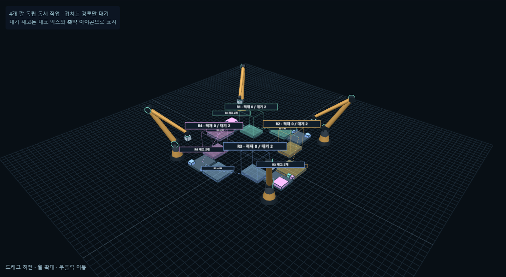

# 네 팔의 동시 작업과 회수 판단 · 2026-10-06

[직접 적재 예제](http://127.0.0.1:5173/?palletDemo=relay#pallet) · [혼합 입력](http://127.0.0.1:5173/?palletDemo=compact&palletView=relay#pallet) · [실제 혼합 측정](pallet-concurrent-measurements.json) · [브라우저 기록](pallet-concurrent-browser.json)

## 상태와 실행

이전 버전의 한 동작짜리 전달을 `send`, `receive-place`, `receive-queue`로 분리했습니다. 일반 적재는 `place`입니다. 네 팔 각각 최대 1개 작업을 갖고 작업 시간이 겹칩니다. 각 팔이 끝나면 그 팔의 다음 작업을 계산하며 전체 작업군이 끝날 때까지 기다리는 장벽이 없습니다. 계산은 Worker에서 하고, 실행 중인 다른 팔의 애니메이션은 계속됩니다.

박스 상태는 자기 재고 `queued` → 외부 전달대 `staged` → 받는 팔의 `placed` 또는 `queued`입니다. `send`는 전달대에 놓고 팔이 이탈한 뒤 확정됩니다. `staged` 동안 원래 담당을 유지합니다. 옆 팔이 가져다 놓고 이탈까지 완료하면 담당과 방문 이력을 한 번 변경합니다. 이 기간에 원래 팔은 다른 박스를 처리할 수 있습니다. 이미 쌓은 박스는 다시 꺼내지 않습니다.

팔레트/자기 재고는 작업셀 버전으로, 공유 전달대는 별도 버전으로 검증합니다. 다른 팔의 완료가 전역 이력 번호를 바꿔도 자신의 의존 상태가 유효하면 완료를 확정할 수 있습니다. 같은 팔·박스·전달대를 중복 예약하지 않습니다. 같은 동작 재적용, 다른 실행의 동작, 비인접 전달, 방문 셀로의 재전달을 거절합니다. 전체 박스 ID가 자기 재고 + 전달대 + 적재 중 정확히 한 번 존재하는지 매 확정마다 검사합니다.

전달대는 링의 바깥쪽에 각각 1박스 자리로 배치했습니다. 보내는 팔이 사용 중인 동안 옆 팔은 해당 전달대에 들어가지 않고 다른 작업을 합니다. 회수 중에는 새 박스를 같은 전달대로 보내지 않습니다. 운반 박스와 공구의 경로별 보수적인 외곽이 겹치는 작업도 동시에 시작하지 않습니다. 이 예약은 전체 동작 동안 유지하므로 가능한 동시성을 모두 활용하는 최적 스케줄러는 아닙니다.

## 보내는 팔과 받는 팔의 결정

1. 자기 재고에서 박스·자세·위치를 기존 혼합 계획기로 고릅니다. 현재 가능한 남은 박스의 검토 자리가 없어지는지 다시 검사합니다. 방해 후보 또는 적재/접근 불가 후보는 옆 전달대에 보류할 수 있습니다.
2. 받는 팔은 자기 작업이 끝난 시점에 전달대에 확정된 박스를 검사합니다. 수신 시점의 팔레트와 자기 재고를 사용합니다. 보내는 순간의 배치 결정을 강제하지 않습니다.
3. 후보 중 지지·반력·하중·재질·회전·높이·경계·잔량과 전달대 출발 경로를 만족하는 위치가 있으면 **전달대에서 팔레트로 직접** 옮깁니다. 자기 입고대에 먼저 내려놓지 않습니다.
4. 즉시 적재할 후보가 없거나 잔량 배치를 막으면 **자기 대기 재고**로 회수합니다. 전달 경로/가반 조건도 맞지 않으면 전달대에 그대로 두고 다른 작업을 검토합니다.
5. 회수해 보관한 박스가 아직 방해된다면 가능한 다른 받침을 먼저 적재합니다. 바로 다른 팔로 다시 보내는 불필요한 순환을 피합니다. 이후에도 그 셀에서 적재하지 못하면 미방문 이웃으로만 전달할 수 있습니다.

후속 검사는 후보 상한 64개, 비교 후보 4개, 손실 재검사 최대 4종의 제한된 탐색입니다. 전체 연속 공간의 최적해나 배치 불가능성 증명이 아닙니다.

## 취소와 재생

취소는 진행 중 미확정 동작만 되돌립니다. 이미 전달대에 내려놓은 박스, 이미 적재한 박스, 이미 받은 자기 재고를 되돌리지 않습니다. 일시정지는 네 팔과 재생 시계를 함께 멈춥니다. 이력은 작업 완료 사건마다 저장하고 읽기 전용으로 봅니다. 실행 JSON v2는 세계 상태, 현재 동작, 완료 기록의 시작/종료 시각을 담습니다.

브라우저의 재생 시계에는 실행 중 다른 팔을 계획하느라 기다리는 시간이 재생 배속에 따라 반영될 수 있습니다. 실제 설비 생산성 지표가 아닙니다. 아래 순수 엔진 측정은 계산 지연을 제외한 사건 기반 시뮬레이션 시간입니다.

## 검증 결과

- 직접 적재 예제: 시작부터 4대 동시 동작, 보류 2회, 직접 회수 적재 2회, 총 8개 적재. 다른 팔이 끝나기 전에 먼저 끝난 팔이 다음 작업을 시작합니다.
- 보관 예제: 4대가 보류 → 옆 박스 회수·재고 보관 → 자기 받침 적재 → 보관 박스 적재. 보류 4회, 보관 회수 4회, 총 8개 적재. 불필요한 재전달 없음.
- 회귀: 벤치마크를 제외한 22개 파일, 214개 테스트 통과. 협업 7개에는 병렬 시작, 비동기 확정, 점유 대기, 수량/소유권, R4→R1, 가반/순환 방지, 두 수신 분기가 포함됩니다.
- 웹: 협업 4개 + 기존 보류 2개 통과. 단순 팔 개수 표시뿐 아니라 네 팔 TCP 좌표가 동시에 변하는지, 독립 재시작, 전달대 점유 중 취소 보존, 이력, 1440/390px, 기존 모드 유지까지 확인했습니다. 독립 재시작은 계산 지연을 관찰할 수 있는 4배속에서 검사했습니다.
- 타입/Vite 빌드 통과. 기존 큰 청크 경고 유지.

| 입력 시드 | 전체 | 적재 / 대기 | 최대 동시 | 직접 적재 회수 | 재고 보관 회수 | 엔진 완료 시간 | 팔레트 강체 검사 |
| --- | ---: | ---: | ---: | ---: | ---: | ---: | --- |
| 20261004 | 30 | 29 / 1 | 4 | 3 | 5 | 242.38 s | 4곳 모두 stable |
| 7919 | 24 | 23 / 1 | 4 | 3 | 3 | 160.64 s | 4곳 모두 stable |

네 팔레트에 분산한 결과이며 한 팔레트의 적재율과 직접 비교하지 않습니다. 3초 강체 검사의 최대 변위는 각각 0.228mm, 0.134mm 이내입니다. 각 입력의 미적재 1개는 자기 재고에 남았고 모든 전달대는 비었습니다. 물량은 복제하거나 삭제하지 않았습니다.

## 모델 범위

이미 도착한 전체 재고를 네 셀에 나누며 대기 더미는 임의 접근 가능한 재고로 모델링합니다. 전달대 800×800mm, 재고대 800×650mm, 고정 길이 가상 팔을 사용합니다. 공유 영역 출발은 기존 단일 셀 XY 사각형 대신 협업 배치와 가상 팔 도달 검사(구간별 13표본)를 씁니다. 팔레트 경계·관통·지지·누적 반력·하중·재질·허용 자세·세로 박스 주변 높이 제약을 유지합니다.

TCP 도달과 운반 상자/공구 경로 예약은 실제 로봇의 전체 링크 연속 충돌 인증이 아닙니다. 실제 관절 제한·전체 링크끼리의 충돌·흡착·포장 압축 변형·복잡한 더미에서 꺼내기는 미검증입니다.

