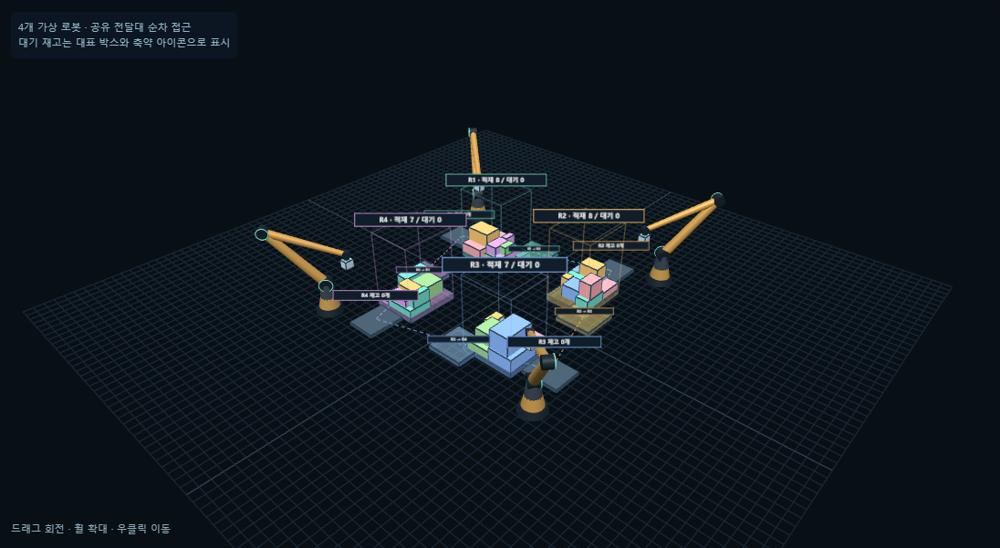

# 이전 직렬 버전 기록 · 네 로봇의 인접 재고 전달

현재 구현은 **[독립 동시 실행과 받는 팔 판단](FOUR-ROBOT-CONCURRENT.md)**으로 변경되었습니다. 아래 순차 스케줄과 수치는 이전 버전의 기록입니다.

[현재 혼합 입력으로 4대 작업셀 열기](http://127.0.0.1:5173/?palletDemo=compact&palletView=relay#pallet) · [전달을 확인하는 8개 예제](http://127.0.0.1:5173/?palletDemo=relay#pallet) · [혼합 입력 측정](pallet-relay-measurements.json) · [브라우저 검증](pallet-relay-browser.json)

## 바뀐 구조

네 로봇은 각각 독립적인 팔레트와 선택 가능한 대기 재고를 가집니다. 기존의 '같은 팔레트 옆에서 보류한 뒤 상단으로 복귀'와 별개로, 협업 모드에서는 **R1 → R2 → R3 → R4 → R1** 방향의 옆 로봇 대기 재고로 박스를 보냅니다. 초기 전체 물량을 네 곳에 나누며 물량을 4배로 복제하지 않습니다. 기존 단일 팔레트 모드의 확정 배치는 유지하고 모드를 바꾸면 진행 중 미확정 동작을 취소합니다.

입력은 이미 도착한 전체 재고입니다. 박스 치수·질량·재질·허용 하중·자세·팔레트 크기와 적재 제약을 유지합니다. 네 팔레트에 분산하므로 한 팔레트 실험과 적재량을 직접 비교해서 알고리즘 개선이라고 주장하지 않습니다.

## 판단 순서

1. 셀을 순환 방문하며 그 셀의 재고만으로 기존 혼합 공간 계획기를 실행합니다. 종류별 후보 상한은 64개, 최종 비교 후보는 4개입니다. Greedy/BL/Rollout을 선택할 수 있습니다.
2. 다음 후보 A를 놓으면 현재 가능한 다른 박스의 검토 위치가 없어지는지 확인합니다. 잔량 표본에서 손실이 생기면 최대 4종에 대해 64개 후보로 다시 확인합니다. 연속 공간 전체의 불가능성을 증명한 것은 아닙니다.
3. 옆 셀에 A를 둘 수 있는 후보를 검사하고, 그 후보가 받는 셀의 기존 재고를 막지 않는지도 확인합니다. 후보 상위 4곳에서 검사하며, 이미 방문한 셀로는 다시 보내지 않습니다.
4. 수용 가능하면 공유 전달대 경로를 생성합니다. 보내는 팔이 집기 → 전달대에 놓기 → 자기 대기 위치로 이탈한 다음, 받는 팔이 집기 → 안전 높이에서 방향 맞추기 → 자기 입고 재고 위치에 놓기 → 이탈합니다.
5. 전달할 수 없으면 현재 큐에 그대로 두고 다른 안전한 박스를 먼저 놓는 후보를 찾습니다. 현재 셀의 적재 자체가 불가능할 때도 옆 셀에 남은 박스를 제안합니다. 네 셀 모두 적재/전달 후보가 없을 때만 대기 상태로 마칩니다.
6. 확정 직전에 적재 제약 또는 전달 경로와 받는 쪽 수용 가능성을 다시 검사합니다. 이미 적재한 박스는 이동시키지 않습니다.

각 박스는 현재 담당 `owner`, 방문한 셀 `visited`, `queued/placed` 상태와 원래 관측값을 유지합니다. 전달 완료 시에만 보내는 큐에서 제거하고 받는 큐에 추가합니다. 동작 중에는 기존 담당 재고로 계산합니다. 방문 셀은 최대 4개이므로 박스당 최대 3회 전달 후 1회 적재, 전체 동작은 최대 `4 × 박스 수`입니다. 인접하지 않은 전달, 중복 ID, 이전 실행/이전 단계 동작은 거절합니다. 어디에서도 배치할 수 없는 박스는 삭제하지 않습니다.

## 작업셀과 검증 경계

- 2×2 순환 작업셀, 공유 전달대 800×800 mm, 각 입고 재고대 800×650 mm입니다. 대기 더미 전체는 대표 박스와 축약 아이콘으로 보여줍니다. 복잡한 더미에서 박스를 꺼내는 문제는 모델 밖입니다.
- 공유 영역과 로봇 동작은 **순차 스케줄**입니다. 네 로봇을 표시하되 4배 처리속도나 동시 작업 최적화를 주장하지 않습니다.
- 팔레트 적재에는 기존 관통·경계·반력·누적 하중·재질·허용 자세·주변 높이·설정된 그리퍼 접근 조건을 적용합니다.
- 셀 사이 전달에는 가반, 작업 높이, 고정 길이 가상 팔 TCP 도달(구간별 13표본), 운반 상자/공구의 보수적인 직사각 경로 영역을 검사합니다. 회전 구간은 수평 대각선 길이를 외곽으로 사용합니다.
- 전달 시 수평 작업영역은 네 셀의 실제 표시 배치로 정의합니다. 기존 단일 셀의 직사각 작업영역을 네 셀 전체에 그대로 적용하지 않습니다. 실제 로봇 관절 한계·전체 링크의 연속 충돌·주변 팔과의 충돌·흡착력·포장 변형은 미검증입니다. 그림의 링크 간섭 색상은 근사 진단입니다.
- 전역 최적해를 보장하지 않습니다. 받는 셀의 현재 수용 검사는 나중에도 반드시 적재된다는 보증이 아니며, 이후 매 동작에서 다시 계획합니다.

## 실행 결과

고정 예제는 총 8개입니다. R1의 A1, R3의 A3을 먼저 바닥에 놓으면 각자의 넓은 받침 F1/F3이 들어가지 못합니다. A1은 R2로, A3은 R4로 이동하고 각각 받는 팔레트에 놓입니다. **전달 2회 + 적재 8회 = 10동작**, 대기 0개, ID/수량 보존입니다. R4→R1 연결은 회전시킨 동일 입력으로 별도 검증했습니다.

같은 저장된 혼합 박스 입력을 네 재고에 시드 순서로 분배한 실제 계산입니다. 생성 시드와 분배 시드를 같은 값으로 두었습니다.

| 입력 시드 | 초기 물량 | 적재 / 대기 | 전달 | R1 / R2 / R3 / R4 적재 | 팔레트별 강체 결과 |
| --- | ---: | ---: | ---: | --- | --- |
| 20261004 | 30 | 29 / 1 | 1회 | 8 / 7 / 6 / 8 | 4곳 모두 stable |
| 7919 | 24 | 23 / 1 | 3회 | 5 / 6 / 5 / 7 | 4곳 모두 stable |

첫 입력의 B9는 후속 B24의 자리를 보존하기 위해 R3→R4로 전달됐습니다. 두 번째 입력은 방해 예측 1회와 현재 배치 불가로 인한 전달 2회입니다. 각 입력의 미적재 박스 1개도 큐에 남아 있습니다. 강체 검사는 기존 3초 설정이며 최대 변위는 각각 0.222 mm, 0.134 mm 이내였습니다.

## 화면과 재현

상단 **4대 로봇 협업**에서 현재 박스 세트, 8개 전달 예제, 새 랜덤 혼합 세트를 고릅니다. 정책/전달/초기 분배 설정을 바꾸면 새 실행입니다. **4대 자동 실행**, **협업 한 동작**, 일시정지, 취소, 셀별 확대, 이력, JSON 저장을 제공합니다. 네 재고 카드에 받은 박스와 담당 이력이 표시됩니다. 전체 적재/대기 수량은 전달 도중에도 유지됩니다.

이력은 각 적재/전달 완료 시점의 네 셀 상태를 저장합니다. 과거 이력은 읽기 전용이며 현재로 돌아오면 원래 실행을 이어갑니다. 중간 동작 취소는 미확정 시뮬레이션을 되돌리는 기능으로 실제 로봇의 물리적 취소 동작을 의미하지 않습니다.

검증: 기존 단위 206개 + 협업 6개, 혼합 입력 2개 및 총 8개 팔레트 강체 검사, 협업 웹 3개와 기존 보류 웹 2개. 타입/배포 빌드 통과. 기존 번들 크기 경고는 유지합니다.

