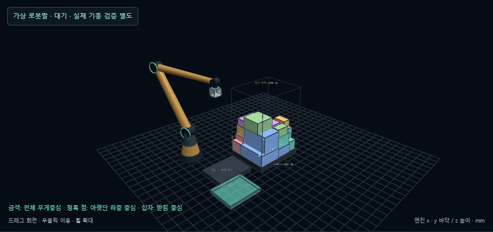

# 가상 로봇팔 · 2026-10-05

[예제 실행](http://127.0.0.1:5173/?palletDemo=robot#pallet) · [실제 혼합 적재 화면](pallet-robot-arm-mixed.png) · [세워 돌리는 동작](pallet-robot-arm-tilt.png)

팔레트 옆에 고정 베이스, 상완, 전완, 손목, 그리퍼를 표시합니다. 기존 계획기가 만든 집기·이송·회전·놓기·복귀 TCP 경로를 따라 관절 각도를 매 프레임 계산합니다. 임의로 만든 적재 애니메이션이나 외부 AI 호출은 사용하지 않습니다.

## 사용법

**로봇 작업셀**로 전체 장면을 보고, 드래그로 회전하고 휠로 확대합니다. **로봇팔** 체크로 표시를 전환합니다. **가상 로봇팔 · 길이와 설치 위치**에서 베이스 X/Y, 어깨 높이, 상완·전완 길이를 바꿀 수 있습니다. 기본값 버튼은 표시 설정만 복원합니다. 재생 속도·일시정지·계속 재생은 팔과 운반 박스에 동시에 적용됩니다. 이상적 적재 환경은 팔과 그리퍼를 숨깁니다.

## 기구학

엔진 좌표는 x/y 바닥, z 위쪽, 단위 mm입니다. 기본 베이스는 (-900,-450), 어깨 높이는 650, 상완과 전완은 각각 1600, 손목 길이는 120입니다. 특정 제조사 로봇을 복제한 수치가 아닙니다. 입고대에 겹치지 않게 배치했으며, 기존 계획기의 수평 TCP 반경 중심과 독립입니다.

목표 TCP에서 그리퍼 법선 방향으로 `그리퍼 높이 + 손목 길이`를 더해 손목 목표를 구합니다. 베이스 yaw를 구한 후 해당 수직 평면에서 두 링크의 코사인 법칙으로 어깨·팔꿈치 각도를 구합니다. 높은 팔꿈치 해를 사용합니다. 손목의 방향은 기존 6자세 간 쿼터니언 보간을 그대로 따릅니다. 링크 길이는 고정됩니다.

목표가 두 링크의 최소/최대 도달 거리 밖이면 가능한 손목 위치까지만 움직입니다. 실제 팔 끝과 목표 TCP의 거리를 표시하고 빨간 점선으로 연결합니다. 팔 길이를 늘리거나 목표에 도달했다고 표시하지 않습니다. 도달 여부는 가상 팔의 위치 오차 0.01mm 미만으로 정의한 수치 검사입니다.

## 간섭 표시와 적용 범위

상완·전완·손목 링크의 중심 선분을 반경 105/80/65mm만큼 확장한 박스 AABB와 비교하는 보수적인 근사입니다. 현재 계획 프레임의 적재 박스와 바닥에 대한 접촉 가능성을 빨간 링크와 상태 문구로 표시합니다. 완성된 배치를 물리적으로 복제하는 Rapier 검사와 별도입니다.

표시용 팔은 **계획기 입력, 확정 배치 좌표, 기존 작업 시간 계산에 영향을 주지 않습니다**. 도달 실패/링크 간섭이 나타나도 경로를 재계획하거나 적재를 중단하지 않습니다. 전체 경로 충돌 판정, 팔의 자기 충돌, 베이스·입고대·팔레트·운반 중 박스와 팔 사이 충돌, 실제 기종의 관절 범위·속도·토크·흡착력은 미검증입니다. 물리 검증 재생에서 간섭 표시는 이동한 강체가 아닌 원래 계획 박스를 기준으로 합니다.

## 확인한 결과

- 새 순수 수학 검사 5개: 6자세 TCP/FK 일치, 링크 길이 보존, 외부/내부 도달 실패, 수직/일치점 특이 위치, 선분/AABB 접촉, 기존 16개 적재 경로 500개 이상 표본 자세. 기존 자세·요구사항 검사와 합해 25개 성공.
- 브라우저: 집기·세움·정지/재개, 팔 표시 전환, 상완/전완을 200mm로 줄일 때 도달 실패, 그 상태에서도 링크 길이와 적재 결과 보존, 기본값 복원, 이상적 모드 숨김. 1440/390/320px 가로 넘침 없음.
- 실제 혼합 입력의 웹 계산 결과는 16개·높이 1325mm로 이전과 같습니다. [실행 결과 JSON](pallet-robot-arm-browser.json)은 해당 배치 지표, 표시 팔 자세와 패턴 평가를 담고 있습니다. `patternEvaluation.ik`는 실제 기종 검증 상태를 가리키므로 여전히 미검증입니다.
- 새 브라우저 2개와 기존 세움 2개 성공 후 기본 카메라 방향을 조정했고, 새 2개를 다시 통과했습니다. TypeScript/Vite 빌드 성공.

