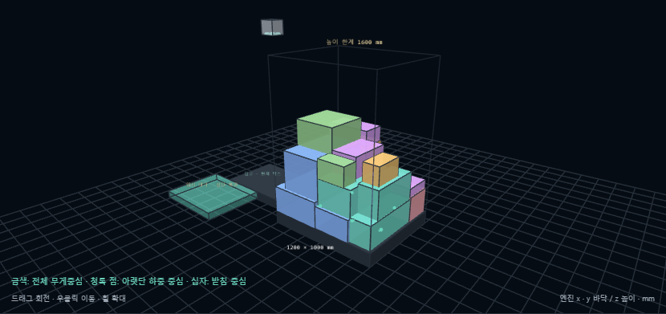
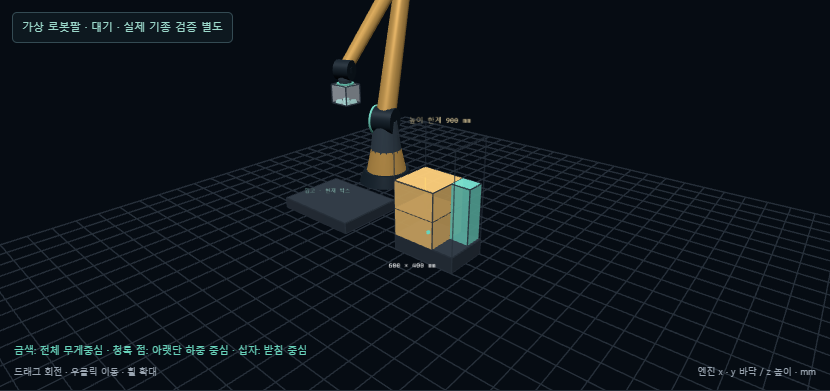

# 세로 박스의 주변 높이 맞춤 · 2026-10-06

[실행](http://127.0.0.1:5173/?palletDemo=compact#pallet) · [동일 입력 비교](pallet-standing-height-measurements.json) · [웹 실행 결과](pallet-standing-height-browser.json)

바닥 지지와 누적 무게중심을 통과해도 좁고 긴 박스가 이웃보다 홀로 솟을 수 있었습니다. 이번 변경은 이런 후보를 배제하고 주변에 눕혀 쌓은 박스와 높이가 맞는 위치에 세로 박스를 넣습니다. 재고 선택 모드에서는 세로 박스를 보류한 동안 배치 가능한 눕힌 박스를 쌓고, 다음 단계마다 모든 재고를 재검사합니다.

## 판정 규칙

1. 실제 배치 높이가 바닥의 짧은 변보다 **1.25배 초과**이면 긴 세로 박스로 분류합니다. 회전 코드와 무관하므로 처음부터 세로로 긴 박스도 포함합니다. 옆면으로 돌렸어도 넓고 낮아진 자세는 이 제한의 대상이 아닙니다.
2. 같은 위치의 받침이 아닌 **옆쪽의 눕힌 박스**를 높이 기준으로 찾습니다. 옆면 간 거리는 `max(20mm, 설정된 수평 작업 여유)` 이내, 해당 면의 수평 길이 중 50% 이상이 겹쳐야 하며 수직 구간도 겹쳐야 합니다. 떨어진 기둥, 모서리의 작은 조각, 다른 긴 세로 박스는 기준으로 인정하지 않습니다.
3. 후보의 상단이 이웃의 상단보다 솟는 높이는 **100mm와 후보 높이의 25% 중 작은 값 이하**여야 합니다. 상단이 이웃보다 낮으면 돌출은 0입니다. 이웃 상단 높이는 바닥부터 쌓인 실제 좌표로 계산하므로 여러 층의 눕힌 박스와 비교할 수 있습니다.
4. 기준 이웃이 없거나 높이 차를 넘으면 후보를 거절합니다. 확정 배치를 유지하고 박스를 줄이거나 늘리지 않습니다. 넓은 방향으로 눕히는 다른 허용 자세도 계속 탐색합니다.

가로·세로 교차 배치와 6자세는 유지합니다. 위아래 유지, 지지율, 관통·경계, 반력 평형, 누적 하중, 무게 규칙, 그리퍼 경로 검사는 그대로 적용합니다. 같은 높이의 이웃이 있다고 세로 박스의 지지율이나 허용 하중을 올리지 않습니다. 이웃 면이 전도를 막는 물리적인 지지라고 가정하지도 않습니다.

## 계획기 연결

후보 예산을 쓰기 전의 기하 검사, 상세 제약 검사, 최종 배치 확정, 잔량 위치 탐색에서 같은 판정을 사용합니다. 현재 주변이 낮아 막힌 세로 박스는 재고에서 삭제되지 않습니다. BL/Greedy/Rollout 모두 고정 예제에서 **눕힌 박스 → 눕힌 박스 → 옆 빈자리의 세로 박스**를 선택했습니다. 세로 박스의 바닥은 0mm이고 두 층의 눕힌 박스와 상단이 500mm로 같습니다. 웹에서도 실제 그리퍼 회전/배치와 이 순서를 확인했습니다.

버퍼 없는 순차 입고는 이미 도착한 현재 박스만 처리합니다. 첫 박스가 긴 세로 박스이고 주변 적재가 없으면 중단할 수 있습니다. 기본 온라인 입력은 이번 조건을 켜면 첫 박스에서 중단하며, 조건을 끄면 이전 8개 적재 결과가 재현됩니다. 미입고 박스를 미리 꺼내 쌓지 않습니다. 사용자가 요청한 재고 모아서 배치는 **현재 재고 모아서 실행** 또는 위 직접 링크로 실행합니다.

## 같은 랜덤 입력의 결과

이전 6자세 실험의 치수·무게·재질·허용 자세·지지·그리퍼 제약을 보존하고 새 높이 조건만 추가했습니다. 시드는 박스 세트 시드입니다. 이전 배치의 위반 수도 새 규칙으로 다시 계산한 값입니다.

| 시드 | 적재 수 이전 → 수정 | 수정 높이 | 긴 세로 박스 수 | 주변 높이 위반 이전 → 수정 | 강체 검사 최대 이동 |
| --- | ---: | ---: | ---: | ---: | ---: |
| 20261004 | 16 → 16 | 964mm | 1 | 4 → 0 | 0.377mm |
| 7919 | 15 → 9 | 619mm | 0 | 4 → 0 | 0.247mm |
| 20261005 | 19 → 17 | 770mm | 6 | 6 → 0 | 0.327mm |

기본 입력은 최고 높이 1325→964mm, 높이대별 내부 채움 72.1→87.5%, 적재 부피 0.716→0.728m³입니다. 세로 박스 B19-01의 상단은 546mm, 옆의 눕힌 B13-01 상단은 521mm로 차이가 25mm입니다. 다른 입력에서는 적재 수와 부피가 줄었으므로 항상 공간 활용이 개선된다고 주장하지 않습니다.

모든 확정 단계의 제약·수량 보존을 검사했습니다. Rapier 조건은 기존과 같은 3초, dt 1/120초, 허용 이동 5mm/회전 3°, solver 12회입니다. 세 결과 모두 해당 강체 검사에서 안정이었습니다. 이 관측이나 새 기하 정책이 실제 운송/포장 안정성 인증을 뜻하지는 않습니다.

## 화면과 저장

- **적재 제약 · 환경 → 세로 박스 주변 높이 맞춤**: 기본 켜짐. 최대 돌출 mm를 수정한 뒤 **설정 적용 · 새 실행**으로 적용합니다. 변경 전 실행은 원래 조건으로 보관합니다.
- **내부 공간과 박스 자세 → 세로 박스 · 주변 층 높이 비교**: 박스 상단, 이웃 상단, 실제 돌출, 허용값을 표시합니다. 과거 프레임은 당시 제약과 당시 박스만 사용합니다.
- JSON의 `constraints.standingHeight`는 `{enabled:true,maxRiseMm:100}`입니다. 필드가 없는 구 입력에도 기본값을 적용합니다. 이전 방식의 연구 재현은 `enabled:false`로 명시할 수 있습니다.
- 로봇팔 표시와 기존 그리퍼 동작을 유지합니다.

## 검증

단위 회귀 19개 파일 **196개 성공**. 새 높이 규칙 8개와 기존 적재/자세/재질/로봇팔/2D/3D 검사를 포함합니다. 별도 세 랜덤 입력 측정 시험 1개도 성공했습니다. 새 브라우저 2개, 기존 자세 2개, 온라인 4개로 고유 **8개 성공**입니다. 최초 온라인 테스트는 이전 8개 적재를 새 기본 조건에도 기대해 실패했으며, 새 기본에서의 정당한 중단과 조건을 끈 이전 8개 결과를 각각 검사하도록 수정 후 통과했습니다. 마지막 전체 8개를 한 번에 재실행한 것은 아닙니다. 마지막 소스 변경 후 TypeScript/Vite 빌드 113모듈 성공입니다.

