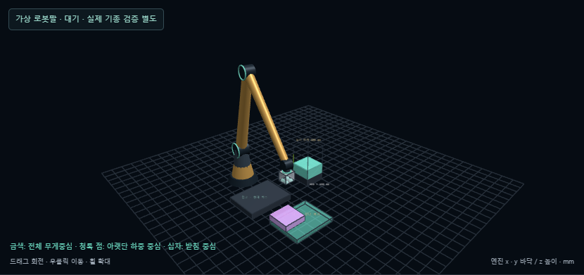
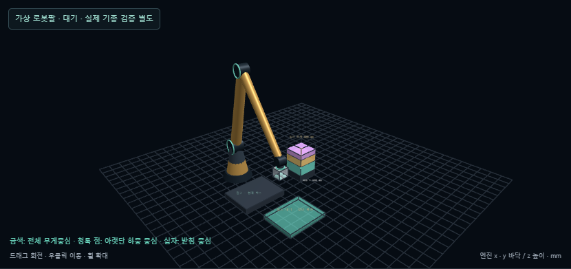

# 임시 보류 후 상단 복귀 · 2026-10-06

[3개 박스 동작 예제](http://127.0.0.1:5173/?palletDemo=buffer#pallet) · [기존 혼합 재고](http://127.0.0.1:5173/?palletDemo=compact#pallet) · [같은 입력 측정](pallet-buffer-measurements.json) · [웹 검증 기록](pallet-buffer-browser.json)

현재 선택한 박스 A가 남은 박스 B의 검토 위치를 없애면 **A 보류 → B 적재 → A 상단 복귀** 순서를 검사합니다. 이미 적재한 박스를 꺼내지 않습니다. 전체 재고 선택과 낮은 빈자리 전략에서 기본 활성화되며, 탐색 범위 설정에서 끌 수 있습니다. 버퍼 없는 순차 입고는 이전처럼 현재 박스만 처리합니다.

## 판단과 확정

1. 기존 계획기가 선택한 A에 대해 잔량의 배치 가능 위치가 감소했는지 검사합니다. 선택되지 않은 후보가 나쁜 순서를 만들 수 있다는 이유만으로 현재의 좋은 순서를 바꾸지 않습니다.
2. 막히는 B를 최대 64개 후보까지 다시 검사합니다. 여전히 검토 위치가 없으면 B를 먼저 놓은 뒤 A를 맨 위에 놓을 수 있는지 검사합니다. 한 단계에서 최대 4개 순서 쌍을 비교합니다.
3. 외부 대기대는 원점 `(-1300,850,0) mm`, 크기 `800×650 mm`, 용량 1개입니다. A의 원래 치수가 들어가야 합니다. 공급 재고를 대기대로 분류하는 이동은 모델 밖입니다. 대기대에서 회수하는 그리퍼 경로는 그 위치를 출발점으로 계산합니다. 대기대의 로봇 반입 이동·전체 링크 충돌·흡착력은 검증한 것으로 간주하지 않습니다.
4. A를 보류한 뒤 다른 박스를 쌓을 때마다 **새 적재의 최고 윗면 이상 높이**에 A가 올라갈 자리를 다시 찾습니다. 최대 8개 후속 후보를 검사합니다. 지지율·반력·누적 하중·무게 순서·세로 박스 높이 맞춤·허용 자세·돌출·관통·그리퍼 접근 조건은 동일합니다.
5. 검토한 다른 배치가 A의 복귀 공간을 보존하지 못하면 A를 먼저 회수합니다. 가능한 다른 박스를 모두 처리한 뒤 복귀하는 것이 목표지만, 높이 여유가 사라지기 전 조기 복귀할 수 있습니다. 제한된 위치 탐색이므로 전역 최적성이나 전체 적재 성공을 보장하지 않습니다.
6. 확정 직전에 선택 박스와 보류 박스의 상단 복귀 위치를 다시 검사합니다. 실패 시 해당 동작을 확정하지 않고 재고를 보존합니다. 외부 대기 중인 박스는 남은 재고에 포함하며, 적재 개수에는 포함하지 않습니다.

`frame.buffer`, 단계별 `bufferBefore/bufferAfter`, `analysis.bufferPlan`에 대기 이유·보호 대상·복귀 후보를 저장합니다. 복귀 위치는 고정 예약 좌표가 아니라 매 단계 다시 검증되는 위치입니다. 이력 되감기·분기·취소·재개·초기화·JSON 내보내기에 같은 상태를 사용합니다.

## 시험 입력과 수정 과정

기능 검증 입력은 400×400 mm 바닥을 공유하는 3개입니다. 위 적재 금지 CAP은 100 mm·1 kg, BASE는 200 mm·10 kg, MID는 150 mm·5 kg입니다. 팔레트 높이 한계는 600 mm입니다. 기본 배치 정책에서 보류를 끄면 CAP을 먼저 놓아 1개에서 중단합니다. 켜면 **BASE → MID → CAP**, 높이 **450 mm**, 3개 모두 적재합니다. CAP은 2단계까지 외부에 있으며 마지막 바닥 높이는 350 mm입니다. Greedy/Rollout도 낮은 높이를 강하게 선호하도록 만든 회귀 입력에서 같은 보류 과정을 통과합니다. 정상 기본 Greedy는 처음부터 올바른 순서를 고르므로 불필요하게 보류하지 않습니다.

첫 구현은 아직 선택하지 않은 위험 후보까지 보류해 무작위 입력에서 16→13개, 9→12개, 17→15개가 되었습니다. [첫 시험 기록](pallet-buffer-first-trial.json)을 보존하고, 실제 다음 선택이 후속 배치를 막는 경우로 한정했습니다.

| 박스 세트 시드 | 적재 수 이전 → 수정 | 높이 이전 → 수정 | 적재 부피 이전 → 수정 | 사용 높이 효율 이전 → 수정 | 상단 복귀 |
| --- | ---: | ---: | ---: | ---: | ---: |
| 20261004 | 16 → 16 | 964 → 964 mm | 0.7282 → 0.7282 m³ | 63.0 → 63.0% | 0개 |
| 7919 | 9 → 11 | 619 → 687 mm | 0.3464 → 0.3303 m³ | 46.6 → 40.1% | 1개 |
| 20261005 | 17 → 17 | 770 → 1145 mm | 0.4760 → 0.4736 m³ | 51.5 → 34.5% | 2개 |

기존 치수·무게·재질·회전·지지·로봇 근사·주변 높이 제약을 그대로 유지했습니다. 모두 3초 강체 검증에서 `stable`, 확정 배치와 예약 복귀 위치 재검사 통과, 수량 보존, 최종 대기 0개입니다. 두 입력은 적재 부피와 높이 효율이 감소했습니다. 개수 증가를 공간 최적화 개선으로 일반화하지 않습니다. 분기와 장기 조합 탐색을 제한한 휴리스틱의 상충입니다.

## 검증

- 단위 검사: 기존 196개와 신규 10개. 보류/복귀·좋은 순서 유지·최고면·높이 여유·접근 불가·확정 재검사·수량·인과성·취소·재생을 확인했습니다.
- 무작위 입력: 저장된 3개 입력의 실제 계산과 독립 강체 검증. 이전 측정은 `pallet-standing-height-measurements.json`입니다.
- 브라우저: 보류 전환·3D 대기대·대기대 출발·취소/재개·이력 분기·내보내기·초기화·설정 해제 2개, 기존 주변 높이와 로봇팔 검사 4개.
- `npm run build` 통과. 기존 번들 크기 경고는 남아 있습니다.

